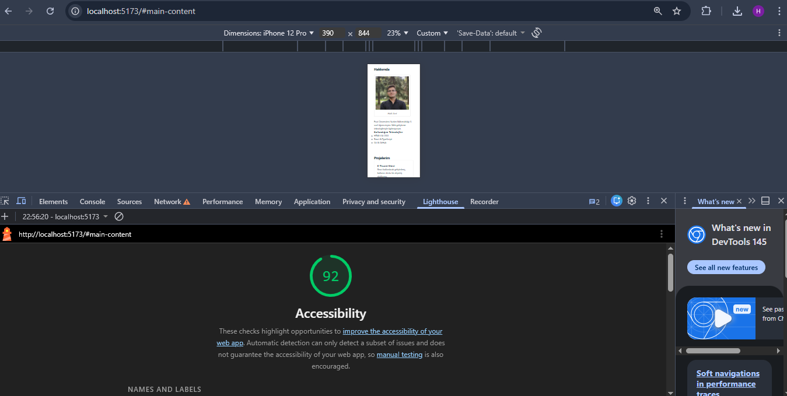
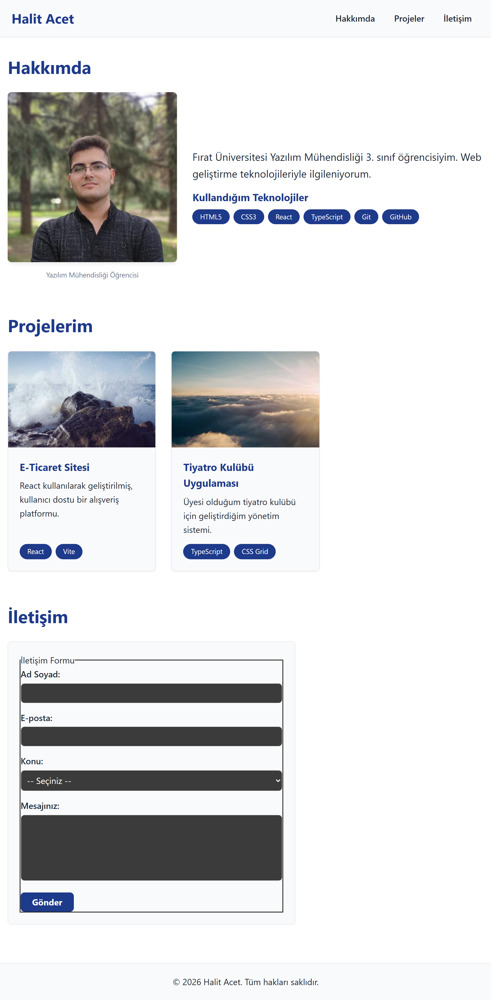
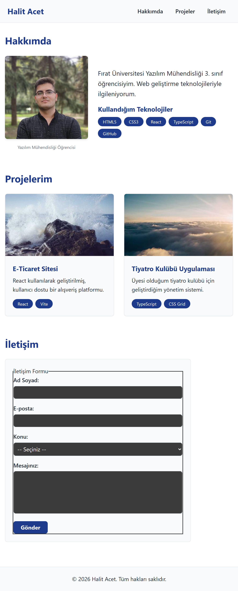
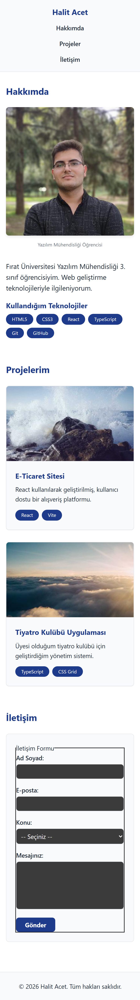

# Web Tasarımı ve Programlama | LAB-2
## Semantik HTML5, Erişilebilirlik (a11y) ve Form Temelleri

Bu proje, web sayfalarının temelini sadece görsel değil; anlamlı (semantik), erişilebilir ve kullanıcı dostu bir yapıda inşa etme becerilerini ölçen bir laboratuvar çalışmasıdır.

### 👤 Öğrenci Bilgileri
* **Ad Soyad:** Halit Acet
* **Öğrenci No:** 230542018
* **Bölüm:** Yazılım Mühendisliği (3. Sınıf)

---

### 🎯 Proje Hedefleri
Laboratuvar föyünde belirtilen aşağıdaki yetkinlikler projeye uygulanmıştır: 
* Semantik HTML5 etiketlerinin doğru ve yerinde kullanımı. 
* WCAG standartlarına uygun erişilebilirlik (a11y) ilkelerinin benimsenmesi. 
* Form elemanlarının label ilişkisi ve doğrulamalar (validation) ile yapılandırılması. 
* Lighthouse aracı ile 90+ erişilebilirlik puanına ulaşılması. 

---

### 🛠️ Teknik Detaylar

#### 1. Semantik HTML5 Yapısı
Sayfa, içeriğin amacını tarayıcıya ve ekran okuyuculara doğrudan ileten semantik etiketler üzerine kurulmuştur. `
` karmaşasından kaçınılarak aşağıdaki hiyerarşi oluşturulmuştur: 
* **`<header>` & `<nav>`:** Sayfa başlığı ve ana navigasyon blokları. 
* **`<main>`:** Sayfadaki birincil içeriği saran ve yalnızca bir kez kullanılan ana kapsayıcı. 
* **`<section>` & `<article>`:** Tematik olarak gruplanmış bölümler ve bağımsız içerik blokları. 
* **`<footer>`:** Telif hakkı ve sosyal medya bağlantılarını içeren alt bilgi alanı. 

#### 2. Erişilebilirlik (a11y) ve Kullanıcı Deneyimi
Erişilebilirlik, engelli bireyler dahil herkesin içeriği algılayabilmesini sağlar. Bu doğrultuda yapılan iyileştirmeler:
***Skip Navigation:** Klavye kullanıcıları için navigasyonu tek tuşla atlamayı sağlayan "Ana içeriğe atla" bağlantısı eklendi. 
***Heading Hiyerarşisi:** Sayfa yapısı $h1 \rightarrow h2 \rightarrow h3$ şeklinde sıralı bir düzen takip eder; hiyerarşik seviye atlanmamıştır.
***Alt Metin (Alt Attribute):** Tüm görsellerde ekran okuyucuların sesli okuyabileceği anlamlı tanımlamalar yapıldı. 
***ARIA & Focus:** Görsel etiketi olmayan alanlar için `aria-label` ve ek açıklamalar için `aria-describedby` kullanıldı. Klavye ile gezinirken `focus` göstergesi görünür bırakıldı. 

#### 3. İletişim Formu ve Doğrulama
Kişisel portföy sayfasında yer alan iletişim formu, erişilebilirlik ve veri bütünlüğü için optimize edilmiştir:
***Label İlişkisi:** Her form alanı, `for/id` eşleşmesi ile `<label>` etiketine bağlanmıştır.
***HTML5 Doğrulama:** `required`, `minlength` ve `type="email"` gibi öznitelikler kullanılarak istemci tarafında veri kontrolü sağlandı.
***Hata Mesajları:** Ekran okuyucuların hataları anında bildirmesi için `role="alert"` özniteliği eklendi. 

---

### 📊 Lighthouse Erişilebilirlik Raporu
Google Chrome Lighthouse denetimi sonucunda sayfa **Accessibility** kategorisinde **92 puan** alarak başarı kriterini karşılamıştır. 

---

### 💾 Git İş Akışı
Proje süreci boyunca föydeki yönergelere uygun olarak branch yapısı kullanılmış ve anlamlı commit mesajları ile süreç kayıt altına alınmıştır: 
* `git checkout -b feature/semantic-portfolio` 
* `feat: add semantic HTML portfolio structure` 
* `feat: add accessible contact form`
* `style: add base CSS and skip link`

---

### 📱 Responsive Tasarım Ekran Görüntüleri

Projenin farklı cihaz boyutlarındaki (Masaüstü, Tablet, Mobil) görünümleri aşağıda sunulmuştur:

#### Masaüstü Görünüm

#### Tablet Görünüm

#### Mobil Görünüm
